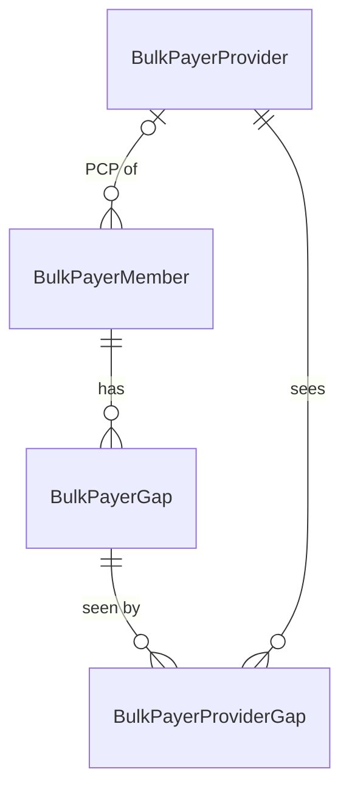

# Shared data model: pseudo-SQL draft

[Back to the data model notes](shared-data-model.md)

- This is pseudo-SQL for discussion. The names, types, and indexes are proposals.
- Built from Collaborate's `alert` tables on the master-record removal branch (`jk/pfa-refactor`, `c6e9e3bf8`) and CDXP's per-payer tables on `DevBranch` (`c67a2d4d`).
- `[both]`, `[C8]`, and `[CDXP]` mark which product needs a column.
- `PHI(type)` marks a column holding PHI. Its storage depends on [the PHI decision](phi-model.md).
- `(S#)` points to a simplification question at the end of this page.



## Partitioning

```sql
-- One partition per tenant (payer or Collaborate customer), created before the tenant exists (CIEP #169995 pattern)
CREATE PARTITION FUNCTION pfBulkPayer (SMALLINT) AS RANGE RIGHT FOR VALUES (1, 2, 3 /* , ... */);
CREATE PARTITION SCHEME   psBulkPayer AS PARTITION pfBulkPayer ALL TO ([PRIMARY]);
```

## BulkPayerMember

```sql
CREATE TABLE cdxp.BulkPayerMember (
    PayerPartitionKey      SMALLINT          NOT NULL,  -- [both] tenant (S1)
    MemberKey              BIGINT            NOT NULL,  -- [both] from a sequence; CDXP <Payer>Member.MemberKey today (S2)
    AlertMemberId          UNIQUEIDENTIFIER  NULL,      -- [C8]   alert.Member PK; sent as FHIR Patient.Id; PFA code and routes key on it (S2)
    LineOfBusinessKey      TINYINT           NOT NULL,  -- [both] C8 LOB VARCHAR(10); CDXP has LOB on the gap only (S3)

    -- Identity
    PayerMemberId          PHI(VARCHAR(50))  NOT NULL,  -- [both] C8 MemberId, CDXP MemberID
    PayerMemberIdHash      BIGINT            NULL,      -- [both] needed for uniqueness only if PayerMemberId is encrypted (S4)
    PlanMemberId           PHI(VARCHAR(50))  NULL,      -- [C8]   same value as CDXP's UniqueMemberId? (S5)

    -- Demographics
    FirstName              PHI(NVARCHAR(45)) NULL,      -- [both]
    LastName               PHI(NVARCHAR(45)) NULL,      -- [both]
    DateOfBirth            PHI(DATE)         NULL,      -- [both]
    Gender                 PHI(CHAR(1))      NULL,      -- [both]
    Zip                    PHI(VARCHAR(10))  NULL,      -- [both] CDXP keeps Zip5
    MRN                    PHI(VARCHAR(50))  NULL,      -- [both]
    Address                PHI(NVARCHAR(45)) NULL,      -- [C8]
    City                   PHI(NVARCHAR(45)) NULL,      -- [C8]
    State                  CHAR(2)           NULL,      -- [C8]
    Phone                  PHI(NVARCHAR(25)) NULL,      -- [C8]
    GovernmentId           PHI(VARCHAR(100)) NULL,      -- [C8]

    -- Matching (CDXP owns)
    RowKey                 BIGINT            NULL,      -- [CDXP] salted hash of member ID + DOB + first name; today's unique key (S4)
    LNameDOBHash           BIGINT            NULL,      -- [CDXP] last name + DOB; drives member-to-patient matching

    -- Attribution and status
    PcpProviderKey         BIGINT            NULL,      -- [C8]   alert.Member.PCPId, resolved to BulkPayerProvider (S9)
    IsTermed               BIT               NULL,      -- [C8]
    IsDeceased             BIT               NOT NULL DEFAULT 0,  -- [C8] added by the master-record removal
    DeceasedDate           DATE              NULL,      -- [C8]
    MemberProperties       NVARCHAR(MAX)     NULL CHECK (ISJSON(MemberProperties) = 1),
                                                        -- [C8]   groups, settlement entity, risk contract, AWV, PBP, market... (S6)
    PayerPathDeltaGapCount INT               NULL,      -- [CDXP]

    -- Lineage and audit
    FirstLoadKey           BIGINT            NULL,      -- [both] C8 FirstStagingRunId; CDXP FileDetailKey (S7)
    LastLoadKey            BIGINT            NULL,
    InsertDate             DATETIME2         NOT NULL DEFAULT SYSUTCDATETIME(),
    InsertedBy             NVARCHAR(128)     NOT NULL DEFAULT SUSER_SNAME(),
    LastUpdated            DATETIME2         NOT NULL DEFAULT SYSUTCDATETIME(),
    LastUpdatedBy          NVARCHAR(128)     NOT NULL DEFAULT SUSER_SNAME(),

    CONSTRAINT PK_BulkPayerMember PRIMARY KEY CLUSTERED (PayerPartitionKey, MemberKey)
) ON psBulkPayer (PayerPartitionKey);

-- One member per tenant, LOB, and payer member ID (TRX's rule today)
CREATE UNIQUE INDEX UX_BulkPayerMember_PayerMemberId
    ON cdxp.BulkPayerMember (PayerPartitionKey, LineOfBusinessKey, PayerMemberIdHash);  -- or PayerMemberId if stored plain
CREATE UNIQUE INDEX UX_BulkPayerMember_AlertMemberId
    ON cdxp.BulkPayerMember (PayerPartitionKey, AlertMemberId) WHERE AlertMemberId IS NOT NULL;
CREATE INDEX IX_BulkPayerMember_LNameDOBHash
    ON cdxp.BulkPayerMember (PayerPartitionKey, LNameDOBHash);
```

## BulkPayerProvider

```sql
CREATE TABLE cdxp.BulkPayerProvider (
    PayerPartitionKey   SMALLINT        NOT NULL,  -- [both] tenant
    ProviderKey         BIGINT          NOT NULL,  -- [both] from a sequence
    LineOfBusinessKey   TINYINT         NOT NULL,  -- [C8]   alert.Provider is unique on (LOB, ProviderId) (S3)
    PayerProviderId     VARCHAR(100)    NOT NULL,  -- [C8]   the payer's provider ID; Member.PCPId points at it (S10)
    NPI                 BIGINT          NULL,      -- [both] C8 VARCHAR(45), CDXP BIGINT (S10)
    TIN                 VARCHAR(45)     NULL,      -- [C8]
    FirstName           NVARCHAR(45)    NULL,      -- [C8]
    LastName            NVARCHAR(255)   NULL,      -- [both] CDXP ProviderNPI.ProviderName
    SpecialtyCode       VARCHAR(45)     NULL,      -- [C8]   CDXP classifies by taxonomy instead
    IsPrimaryCare       BIT             NULL,      -- [CDXP] ProviderNPI.IsPrimaryCare
    GroupId             VARCHAR(100)    NULL,      -- [C8]   group-level access and reporting
    GroupName           VARCHAR(150)    NULL,      -- [C8]
    ProviderProperties  NVARCHAR(MAX)   NULL CHECK (ISJSON(ProviderProperties) = 1),
                                                   -- [C8]   super group, med center, settlement entity, risk contract,
                                                   --        address, phone, SiteId... (S6, S11)
    FirstLoadKey        BIGINT          NULL,      -- [both] (S7)
    LastLoadKey         BIGINT          NULL,
    -- InsertDate, InsertedBy, LastUpdated, LastUpdatedBy as in BulkPayerMember

    CONSTRAINT PK_BulkPayerProvider PRIMARY KEY CLUSTERED (PayerPartitionKey, ProviderKey)
) ON psBulkPayer (PayerPartitionKey);

CREATE UNIQUE INDEX UX_BulkPayerProvider_PayerProviderId
    ON cdxp.BulkPayerProvider (PayerPartitionKey, LineOfBusinessKey, PayerProviderId);
CREATE INDEX IX_BulkPayerProvider_NPI
    ON cdxp.BulkPayerProvider (PayerPartitionKey, NPI) WHERE NPI IS NOT NULL;

-- CDXP's point-of-care registrations stay where they are and join on NPI at delivery time (S11):
--   cdxp.ProviderNPI (site + NPI) and cdxp.PayerProviderNPIRegistration (site + payer + NPI, PayerPath flags)
```

## BulkPayerGap

```sql
CREATE TABLE cdxp.BulkPayerGap (
    PayerPartitionKey      SMALLINT          NOT NULL,  -- [both] tenant
    GapKey                 BIGINT            NOT NULL,  -- [both] platform gap ID from a sequence; the one ID partners see
    MemberKey              BIGINT            NOT NULL,  -- [both]
    LegacyDetailId         INT               NULL,      -- [C8]   alert.Detail.DetailId; CDXP stores it as PayerGapId for some gaps (S8)

    -- What the gap is
    LineOfBusinessKey      TINYINT           NULL,      -- [both] (S3)
    GapTypeKey             TINYINT           NOT NULL,  -- [CDXP] 1 CI, 2 CV, 3 GIC, 4 PatientSafety, 5 MedicineAdherence, 6 SDOH, 7 EDU (S12)
    DetailTypeId           INT               NULL,      -- [C8]   the tenant's detail type (S12)
    DetailCode             VARCHAR(200)      NULL,      -- [C8]   condition or measure code
    EvaluationPeriod       INT               NULL,      -- [C8]   risk and quality (S13)
    ProgramYear            INT               NULL,      -- [C8]   quality only (S13)
    GapSource              VARCHAR(50)       NOT NULL,  -- [both] ANR, OTB, CORE, or a payer feed; drives who is authoritative

    -- IDs partners send
    PayerGapId             VARCHAR(150)      NULL,      -- [both] C8 PartnerGapId VARCHAR(60); CDXP PayerGapId VARCHAR(150)
    InternalGapId          VARCHAR(MAX)      NULL,      -- [C8]   fallback ID when there is no partner ID (S8)

    -- Content
    DetailProperties       NVARCHAR(MAX)     NOT NULL CHECK (ISJSON(DetailProperties) = 1),
                                                        -- [both] C8's JSON payload today; canonical content for both
    ContentBlobLocation    VARCHAR(500)      NULL,      -- [CDXP] <Payer>Gap.FileLocation: the FHIR bundle in blob storage;
                                                        --        blobs are deleted 90 days after their last write (S14)

    -- Program lifecycle (payer and Collaborate own)
    IsInSource             BIT               NOT NULL DEFAULT 1,  -- [both] present in the latest complete dataset
    LatestActivationDate   DATETIME2         NOT NULL,            -- [C8]
    IsExpired              BIT               NOT NULL DEFAULT 0,  -- [both] (S15)
    ExpiredDate            DATETIME2         NULL,

    -- Feedback (Collaborate owns; CDXP writes the external set) (S16)
    FeedbackTypeId         INT               NULL,      -- [C8]   PFA response (Detail.Feedback)
    FeedbackDate           DATETIME2         NULL,      -- [C8]
    FeedbackUser           NVARCHAR(256)     NULL,      -- [C8]
    FeedbackNpi            BIGINT            NULL,      -- [C8]   VARCHAR(45) today (S10)
    FeedbackDiagnosisCode  VARCHAR(30)       NULL,      -- [C8]
    FeedbackSourceId       UNIQUEIDENTIFIER  NULL,      -- [C8]
    ExternalFeedback       VARCHAR(100)      NULL,      -- [both] EHR soft closure that CDXP writes
    ExternalFeedbackNotes  VARCHAR(MAX)      NULL,      -- [both]
    ExternalFeedbackDate   DATETIME2         NULL,      -- [both]
    ExternalSourceId       UNIQUEIDENTIFIER  NULL,      -- [both]

    -- Delivery state (CDXP owns)
    GapStatusKey           TINYINT           NOT NULL DEFAULT 1,  -- [CDXP] (S15)
        -- New 1, Sent 20, Viewed 30, Hide 34, Unhide 35, Updated 40, Addressed 50,
        -- FailedAtSentToPayer 55, SentToPayer 60, Expired 70
    IsVisibleToPointOfCare BIT               NOT NULL DEFAULT 0,  -- [both] replaces FHIR Publish (S17)
    PublishVersion         INT               NULL,                -- [both] the signed-off publish that made it visible (S17)

    -- Lineage and audit
    FirstLoadKey           BIGINT            NULL,      -- [both] C8 FirstStagingRunId; CDXP FileDetailKey or TrackerKey (S7)
    LastLoadKey            BIGINT            NULL,
    -- InsertDate, InsertedBy, LastUpdated, LastUpdatedBy as in BulkPayerMember

    CONSTRAINT PK_BulkPayerGap PRIMARY KEY CLUSTERED (PayerPartitionKey, GapKey),
    CONSTRAINT FK_BulkPayerGap_Member FOREIGN KEY (PayerPartitionKey, MemberKey)
        REFERENCES cdxp.BulkPayerMember (PayerPartitionKey, MemberKey)
) ON psBulkPayer (PayerPartitionKey);

-- One live gap per identity: the master-record removal's live-gap rule, scoped to the tenant (S12, S13)
CREATE UNIQUE INDEX UX_BulkPayerGap_LiveGap
    ON cdxp.BulkPayerGap (PayerPartitionKey, MemberKey, DetailCode, DetailTypeId, ProgramYear)
    WHERE IsInSource = 1 AND IsExpired = 0;

-- Payer gap ID lookups: soft closure, reconciliation, and CDXP feeds that identify gaps this way
CREATE INDEX IX_BulkPayerGap_PayerGapId
    ON cdxp.BulkPayerGap (PayerPartitionKey, PayerGapId) WHERE PayerGapId IS NOT NULL;

-- A member's gaps, with the columns status is derived from
CREATE INDEX IX_BulkPayerGap_Member
    ON cdxp.BulkPayerGap (PayerPartitionKey, MemberKey)
    INCLUDE (GapStatusKey, IsInSource, IsExpired, FeedbackTypeId, ExternalFeedback);
```

## BulkPayerProviderGap

```sql
-- Which providers see a gap, and why (S9)
CREATE TABLE cdxp.BulkPayerProviderGap (
    PayerPartitionKey   SMALLINT   NOT NULL,  -- [both] tenant
    GapKey              BIGINT     NOT NULL,  -- [both]
    ProviderKey         BIGINT     NOT NULL,  -- [both]
    AttributionTypeKey  TINYINT    NOT NULL,  -- [both] PCP, attributed, rendering...; closest existing column is
                                              --        alert.Master.ProviderType (to confirm what it holds)
    NPI                 BIGINT     NULL,      -- [CDXP] copy of the provider's NPI: FHIR Publish batches, PayerPath, and CORE key on NPI (S10)
    IsCoreNpi           BIT        NOT NULL DEFAULT 0,  -- [CDXP] Centene CORE activation (CenteneGap.IsCoreNpi today)
    SourceLoadKey       BIGINT     NULL,      -- [both] the load that asserted this link (S7)
    -- InsertDate, InsertedBy, LastUpdated, LastUpdatedBy as in BulkPayerMember

    CONSTRAINT PK_BulkPayerProviderGap
        PRIMARY KEY CLUSTERED (PayerPartitionKey, GapKey, ProviderKey, AttributionTypeKey),
    CONSTRAINT FK_BulkPayerProviderGap_Gap FOREIGN KEY (PayerPartitionKey, GapKey)
        REFERENCES cdxp.BulkPayerGap (PayerPartitionKey, GapKey),
    CONSTRAINT FK_BulkPayerProviderGap_Provider FOREIGN KEY (PayerPartitionKey, ProviderKey)
        REFERENCES cdxp.BulkPayerProvider (PayerPartitionKey, ProviderKey)
) ON psBulkPayer (PayerPartitionKey);

CREATE INDEX IX_BulkPayerProviderGap_Provider          -- the provider's gap list (PFA grid)
    ON cdxp.BulkPayerProviderGap (PayerPartitionKey, ProviderKey) INCLUDE (GapKey, AttributionTypeKey);
CREATE INDEX IX_BulkPayerProviderGap_Npi               -- NPI-based delivery
    ON cdxp.BulkPayerProviderGap (PayerPartitionKey, NPI) INCLUDE (GapKey) WHERE NPI IS NOT NULL;
```

## Left out on purpose

- **CDXP extensions:**
  - `GapClinicalCode`.
  - `GapAuditLog`.
  - `MemberSite` and `MemberMatchScore`, which stay site-partitioned.
  - `MemberDelta` (PayerPath).
- **Collaborate extensions:**
  - `FeedbackHistory`.
  - `MemberProviderStatus` ("not seen here").
  - `Document`, whose bytes move to Blob Storage.
  - `Mapping` (SSO access).
- **Tenant-keyed configuration:** `DetailType` and `FeedbackType`.
- **Also not shown:** history tables, the row-level security policy, and the load table proposed in S7.

## Questions about what can be simplified

The biggest simplifications are S3, S9, and S12.

- **S1. Tenant key.** Can `PayerPartitionKey` just be `cdxp.Payer.PayerKey`, with a payer row for each Collaborate-only customer?
- **S2. Member keys.** Keep both `MemberKey` and `AlertMemberId` through the transition, then retire the GUID?
- **S3. LOB.** Does LOB live on the member (TRX) or on the gap (CDXP)? And can both products use one LOB code set?
- **S4. Member hashes.** Base identity on a hash of the member ID alone, keep `LNameDOBHash` for matching, and drop `RowKey`?
- **S5. Alternate member ID.** Is CDXP's `UniqueMemberId` the same value as Collaborate's `PlanMemberId`?
- **S6. JSON columns.** Move payer-specific attributes into the JSON columns, and keep as real columns only the keys, filters, and inputs to access mapping (`BuildMapping`) or reports?
- **S7. One load table.** One table for TRX staging runs and CDXP's files, trackers, and publishes?
- **S8. Gap IDs.** Move `InternalGapId` into JSON, and drop `LegacyDetailId` after reconciliation?
- **S9. Provider link.** Is the provider-to-gap link needed at all? The alternatives are one provider on each gap, or linking providers to members.
- **S10. NPI.** Use `BIGINT` for NPI everywhere? For feeds that only send an NPI, is the payer provider ID just the NPI?
- **S11. CDXP sites.** Keep CDXP's site registrations separate and join on NPI? And what is `alert.Provider.SiteId`?
- **S12. Taxonomy.** Keep only `DetailTypeId` on the gap, with the gap type stored on the detail type, and map every feed to detail types?
- **S13. Period.** Use one identity period column instead of both `EvaluationPeriod` and `ProgramYear`?
- **S14. Blob pointer.** Keep the blob pointer per load rather than per gap, or drop it?
- **S15. Expiry.** Take expiry from `IsExpired` alone? Should Hide, Unhide, and Updated be audit events rather than statuses?
- **S16. Feedback.** One feedback column set with a source column, and past responses in `FeedbackHistory`?
- **S17. Visibility.** Derive "visible to point of care" instead of storing it on every gap?
